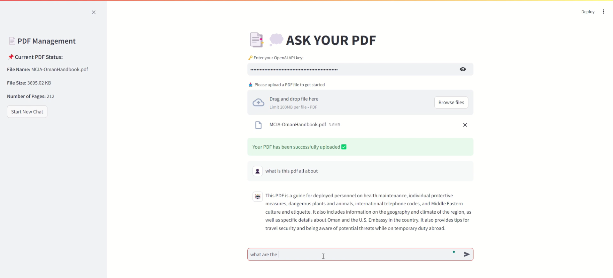
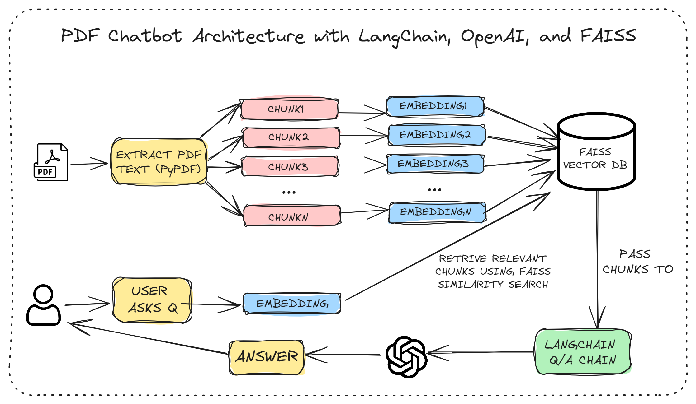

# 📑💭 Ask Your PDF

## Overview

Ask Your PDF is a practice project integrating OpenAI API functionality powered by LangChain to create a PDF chatbot.

## Technologies Used

- **Python:**  Core programming language.
  
- **Streamlit:**  Framework for building web applications.
  
- **OpenAI API:**  Provides AI-powered question-answering capabilities.
  
- **PyPDF2:**  Library for reading PDF files.
  
- **LangChain:**  NLP library for text processing and vector embeddings.
  - LangChain enables advanced natural language processing and integration of various AI models for tasks like text generation, summarization, and question answering.

- **FAISS:**  Library for efficient similarity search.
  - FAISS (Facebook AI Similarity Search) is a library for efficient similarity search and clustering of dense vectors, making it ideal for handling large-scale search queries.

## Features

- **PDF Upload:**  Upload and process PDF files easily.
  
- **Text Extraction:** Extract text content from PDFs.
  
- **Text Splitting:** Manage large texts by splitting them into smaller chunks.
  
- **FAISS Vector Store:** Efficiently search text content using vector embeddings.
  
- **AI-Powered Q&A:**  Ask questions and get answers based on the content of the uploaded PDFs.
  
- **Chat Interface:** A user-friendly chat interface for interaction.

## Demo
[](demo.mp4)

## How It Works in Detail

1. **PDF Text Extraction:**

   - **PyPDF2:**  The `read_pdf` function uses `PyPDF2` to extract text from each page of the PDF document. It iterates through all the pages, collects the text, and compiles it into a single string. This step is crucial for converting the PDF into a format that can be processed and analyzed.

2. **Text Segmentation:**

   - **CharacterTextSplitter:** The `split_text` function utilizes LangChain's `CharacterTextSplitter` to divide the extracted text into smaller chunks. This is necessary because processing the entire document at once can be inefficient and may exceed the model's input size limitations. The text is split into chunks of 800 characters with an overlap of 200 characters to ensure context is preserved across chunks.

3. **Building the FAISS Index:**

   - **OpenAI Embeddings:** The `create_faiss_vector_store` function creates embeddings for each text chunk using the OpenAI API. These embeddings are vector representations of the text chunks.

   - **FAISS:** These vectors are then stored in a FAISS index. FAISS (Facebook AI Similarity Search) is a library designed to perform efficient similarity search and clustering of dense vectors. This index allows for quick retrieval of similar text chunks when a query is made.

5. **Question Answering:**

   - **Semantic Search:** When a user asks a question, the get_answer function converts the query into an embedding and performs a semantic search on the FAISS index to find the most relevant text chunks.

   - **LangChain QA Chain:** The relevant chunks are then passed to the QA chain, which is powered by OpenAI's language model specified by the user's API key. This model uses the context provided by the retrieved text chunks to generate an accurate and contextually appropriate answer.



## How to Use

1. Clone the Repository:

```git clone https://github.com/yourusername/ask-your-pdf.git
cd ask-your-pdf
```

2. Install Dependencies:

```
pip install -r requirements.txt
```

3. Run the Application

```
streamlit run app.py
```
